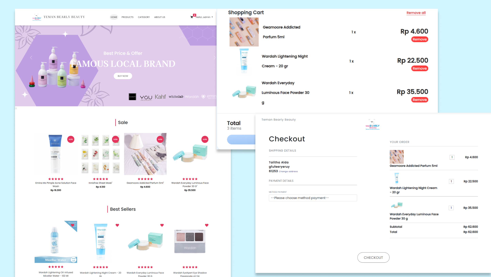

# Hi there, welcome to Teman Bearly 👋

**Teman Bearly** is an e-commerce website offering a variety of skincare and makeup products from the Teman Bearly store. Developed using the **Laravel** framework, this website provides a smooth and comfortable online shopping experience with a user-friendly interface.

## 🚀 Installation Instructions

### Prerequisites

Make sure you have the following tools installed:

- **PHP** (Version 8.0 or higher)
- **XAMPP** (for Apache and MySQL)
- **Composer**

### Installation Steps

1. **Activate XAMPP**:
   - Open the **XAMPP Control Panel** and click **Start** on the Apache and MySQL modules.

2. **Create a New Database**:
   - Access `http://localhost/phpmyadmin/index.php`.
   - Click the **Database** tab at the top.
   - Type "laravel" in the **Database Name** input field and click the **Create** button.

3. **Clone the Repository**:
   - Open a terminal in the desired folder and run the following command to clone the project:
     ```bash
     git clone https://github.com/talithaalda/temanbearly1.git
     ```
   - Navigate into the project directory:
     ```bash
     cd temanbearly1
     ```

4. **Update Dependencies**:
   - Run the following command to update the dependencies:
     ```bash
     composer update
     ```

5. **Configure the Environment**:
   - Copy the `.env.example` file to `.env`:
     ```bash
     cp .env.example .env
     ```
   - Open the `.env` file and update the **DB_DATABASE** value to match the name of the database you created.

6. **Generate Application Key**:
   - Run the following command to generate the application key:
     ```bash
     php artisan key:generate
     ```

7. **Create Storage Symlink**:
   - Run the following command to create a storage symlink:
     ```bash
     php artisan storage:link
     ```

8. **Migrate Database and Seed**:
   - Migrate the database and seed it with initial data:
     ```bash
     php artisan migrate:fresh --seed
     ```

9. **Run the Local Server**:
   - Start the local development server:
     ```bash
     php artisan serve
     ```
   - Access the application in your browser at `http://127.0.0.1:8000`.

10. **Troubleshooting**:
    - If you encounter any errors, try running:
      ```bash
      php artisan optimize
      ```

> **Note**: Product images might not display automatically. To display the images, you need to add them through the admin dashboard under the edit product menu. The product images can be found in the `public` folder.

## 🔐 Admin Dashboard Access

1. **Access the Dashboard**:
   - Go to `http://127.0.0.1:8000/admin`.
   
2. **Admin Login**:
   - Go to /admin
   - Use the following credentials to log in:
     - **Email**: `admin@gmail.com`
     - **Password**: `admin`

## 👥 User Access

1. **User Login**:
   - Navigate to `http://127.0.0.1:8000/login`.
   
2. **User Registration**:
   - If you don't have an account, click **Register Now** and fill in your name, username, email, and password.

3. **Login**:
   - Log in using the email and password you registered with.

---
